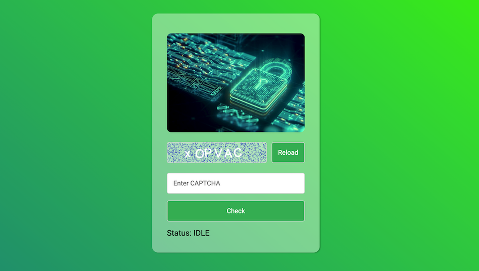

# Captcha App


The Captch App is written in JavaScirpt and creates a CAPTCHA image and a corresponding solution.

The captcha consists of a canvas element where a random string of characters (a-Z, a-z, and 0-9) is drawn with added noise for security. The user can input their response to the captcha into a text field and click a "Check Captcha" button to verify if it matches the randomly generated text on the canvas. If the input is correct, the program will display a success message in green. If the input is incorrect or empty, an error message will be displayed in red.

The program also provides a "Reload Captcha" button that allows the user to generate a new captcha and clear their input field.

## Installation

1. Clone the repository:
   ```bash
   git clone https://github.com/tpreisig/captcha-app
   ```
2. Navigate to the project directory:
   ```bash
   cd captch-app
   ```
3. Run the application:
   ```bash
   open ./index.html
   ```

## License

This project is licensed under the MIT License - see the [LICENSE](LICENSE) file for details.

## Visuals




## Contact

Maintained by tpreisig - feel free to reach out!
